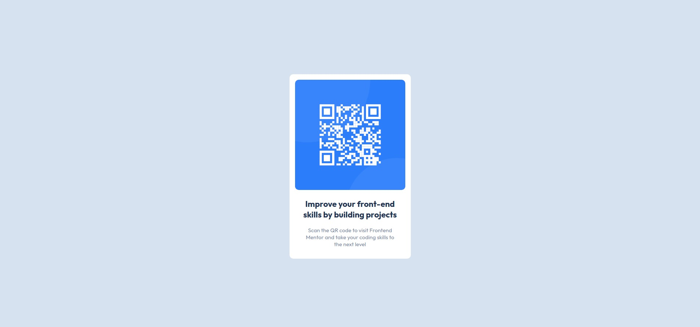

# Frontend Mentor - QR code component solution

This is a solution to the [QR code component challenge on Frontend Mentor](https://www.frontendmentor.io/challenges/qr-code-component-iux_sIO_H). Frontend Mentor challenges help you improve your coding skills by building realistic projects.

## Table of contents

- [Overview](#overview)
  - [Screenshot](#screenshot)
  - [Links](#links)
- [My process](#my-process)
  - [Built with](#built-with)
  - [What I learned](#what-i-learned)
- [Author](#author)

## Overview

### Screenshot

### Links

- Solution URL: [Github](https://github.com/ggsuha/frontendmentor.io/tree/main/001-qr-code)
- Live Site URL: [Github Page](https://ggsuha.github.io/frontendmentor.io/001-qr-code)

## My process

### Built with

- Semantic HTML5 markup
- CSS custom properties
- CSS Grid
- Desktop-first workflow
- [Sass](https://sass-lang.com/) - Sass

### What I learned

I have recently started learning Sass, a powerful CSS preprocessor that offers several advantages in web development. By diving into Sass, I've gained a better understanding of how to improve the efficiency and organization of my CSS code.

One of the main benefits I've discovered is the use of variables. With Sass, I can define variables for colors, font sizes, or any other frequently used values, making it easier to update and maintain my stylesheets. This helps me ensure consistency throughout my projects.

Another aspect I've explored is the concept of nesting. Sass allows me to nest CSS selectors inside one another, which provides a more structured and intuitive way to write styles. This feature helps me avoid repetition and keeps my code tidy.

I have also learned how to import custom fonts into my CSS.

## Author

- Website - [Suhadak Akbar](https://suha.my.id)
- Frontend Mentor - [@ggsuha](https://www.frontendmentor.io/profile/ggsuha)
